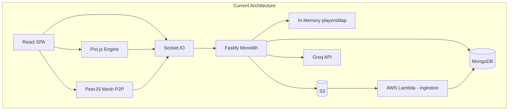
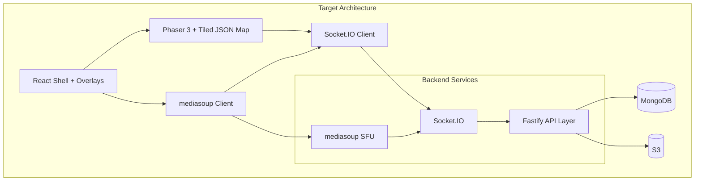
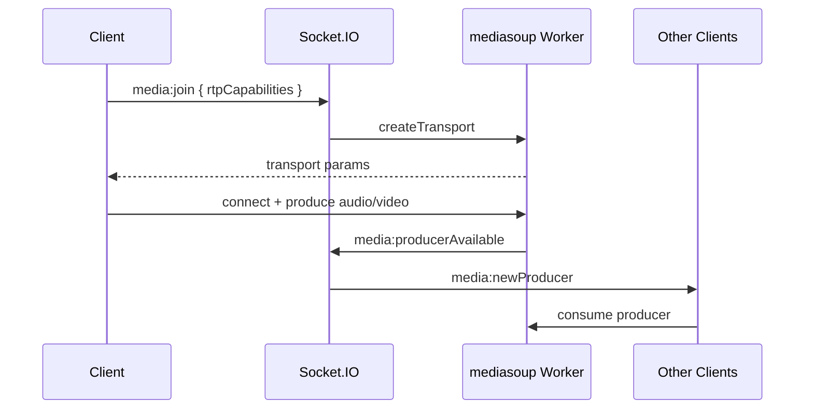
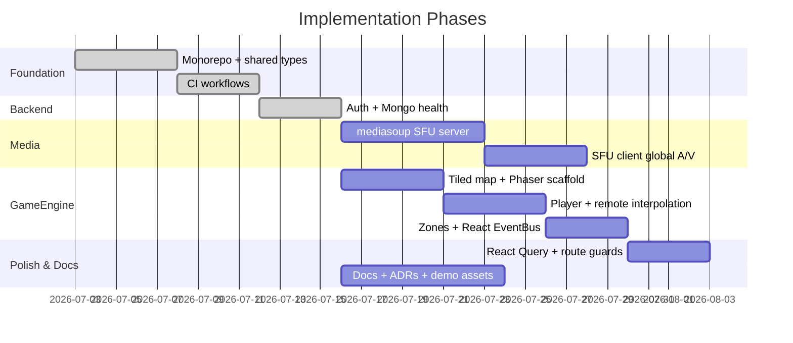

# Portfolio Architecture Transformation Plan

## Design Principles (Scope Constraints)

This overhaul intentionally keeps the app **simple**:

- **One global map** — all connected users share the same world; no spaces, rooms, admin roles, or member management
- **Global player visibility** — every `player:move` is visible to everyone on the map (no spatial culling for movement)
- **Global A/V** — anyone connected can interact with anyone (SFU replaces mesh topology, but does not add proximity gating)
- **Metabot RAG unchanged** — the S3 → Lambda → MongoDB ingestion pipeline already runs in AWS; no in-repo RAG rework

---

## Current State (Baseline)

Your project already has strong bones: a live demo, Pixi.js game engine with collision/zones, Socket.IO multiplayer, PeerJS A/V, Groq-powered Metabot RAG (with AWS ingestion), and production deployment (Vercel + EC2). The gaps holding it back from "senior engineer portfolio" quality are architectural — not feature count.



**Key weaknesses to address:**

- Mesh P2P ([`frontend/src/media/MediaManager.ts`](frontend/src/media/MediaManager.ts)) scales O(n²) — every user calls every other user
- README has placeholder diagrams
- Map is a single LibreSprite PNG with hand-coded collision arrays — should be a proper Tiled JSON tilemap

**Not weaknesses (keeping as-is):**

- Global `player:update` broadcast to all clients — correct for a single shared map where everyone must see everyone
- Metabot RAG pipeline — already functional via AWS Lambda (external to repo)
- `PATCH /user/update-avatar` left open — used during signup before the user has a session
- Login response may include JWT in JSON body — needed by the signup/avatar client flow alongside the httpOnly cookie

---

## Target Architecture



---

## Phase 1: Engineering Foundation (Done)

Establish the quality bar that makes architectural changes reviewable. Local Docker Compose is **out of scope** — production deploy compose / CD pipeline already exists; no separate local Mongo+API compose for now.

### 1.1 Monorepo with Shared Contracts

**pnpm workspace + Turborepo** layout:

```
2D-Metaverse/
├── apps/
│   ├── web/
│   └── api/
├── packages/
│   └── shared/          # Zod schemas, enums, shared types
├── turbo.json
└── package.json         # root scripts: dev, build, lint, check-types
```

**Shared package exports (done):**

- Zod schemas reused by frontend forms and backend controllers (`SignupSchema`, `LoginSchema`, etc.)
- Shared enums / types (`Avatar`, `ChatUserType`, etc.)

Typed `SocketEvents` enum can come later when media/signaling is redesigned in Phase 3 — not a Phase 1 blocker.

### 1.2 CI Pipeline (Alongside CD)

Workflows: [`.github/workflows/CI-api.yml`](.github/workflows/CI-api.yml), [`.github/workflows/CI-web.yml`](.github/workflows/CI-web.yml), with existing CD for API deploy.

| Step      | Web            | API    |
| --------- | -------------- | ------ |
| Install   | `pnpm install` | same   |
| Lint      | ESLint         | ESLint |
| Typecheck | `tsc`          | `tsc`  |
| Build     | `vite build`   | `tsc`  |

### 1.3 Local Docker Compose — Skipped

Skipped. Rely on existing production compose / CD pipeline (`apps/api/compose.yml` + `CD-api.yml`) rather than a recruiter-oriented local `docker compose up` stack.

---

## Phase 2: Backend Hardening (Done)

### 2.1 Auth Middleware + Security

Reusable Fastify `preHandler` (`userHook` in [`apps/api/src/middlewares/user.middleware.ts`](apps/api/src/middlewares/user.middleware.ts)):

| Route                       | Auth                                                                      |
| --------------------------- | ------------------------------------------------------------------------- |
| `POST /user/upload-url`     | Required (`userHook`)                                                     |
| `GET /user/archives`        | Required (`userHook`)                                                     |
| `PATCH /user/update-avatar` | **Open on purpose** — signup avatar pick runs before login/session exists |

JWT already signs with `expiresIn: "24h"` in [`apps/api/src/utils/jwt.ts`](apps/api/src/utils/jwt.ts).

**Intentionally not changing:**

- Login JSON body may still include `token` — signup/avatar client flow needs it; httpOnly cookie remains the primary session for metaverse/socket
- No `@fastify/rate-limit` for now (portfolio scope cut)

### 2.2 Health / Observability (Done)

Full Pino migration / replacing all `console.log` / request-ID / socket debug logging is **done**.

Replaced Fistify pino native logger and ship Mongo connectivity check:

- `GET /api/v1/health` — process liveness
- `GET /api/v1/health/db` — MongoDB `readyState` + `admin().ping()`

---

## Phase 3: SFU Media Architecture (Replace PeerJS)

**Decision: Use [mediasoup](https://mediasoup.org/)** (self-hosted SFU on your EC2) rather than LiveKit Cloud. mediasoup demonstrates deeper WebRTC knowledge — routing, transports, producers/consumers — which is exactly what portfolio reviewers in real-time roles want to see.

### 3.1 Why Replace PeerJS

Current flow in [`MediaManager.ts`](frontend/src/media/MediaManager.ts):

- `new Peer({ secure: true })` → PeerJS public cloud broker
- Full mesh: N users = N×(N-1) WebRTC connections
- No simulcast/SVC — bandwidth waste
- Relies on third-party PeerJS cloud for signaling

### 3.2 New Media Architecture (Global A/V)

All connected users on the single map can hear/see each other — same interaction model as today, but routed through an SFU instead of mesh P2P.



**New backend service:** `apps/backend/src/media/` (or separate `apps/sfu/` process)

- mediasoup Worker pool (1 worker per CPU core)
- Single Router for the global map (no per-space or per-zone routers)
- Signaling over existing Socket.IO (replace `peer:*` events with `media:*`)

**New frontend:** Replace [`frontend/src/media/`](frontend/src/media/) with mediasoup-client

- `MediaManager` → `SFUManager` using `Device`, `Transport`, `Producer`, `Consumer`
- Remove `peerjs` dependency entirely
- On join: consume all existing producers; on new producer event: create consumer

**Infrastructure:** Run mediasoup alongside Fastify on EC2 (UDP ports 40000-49999). Document TURN server setup (coturn) for NAT traversal — even a basic coturn config in repo shows production awareness.

---

## Phase 4: Phaser 3 Migration + Tiled JSON Map

**Decision: Migrate to Phaser 3** with a **Tiled JSON tilemap** as the primary map asset. This replaces both the Pixi.js engine and the current LibreSprite PNG + hand-coded collision approach.

### 4.1 Tiled Map Pipeline (Primary Map Asset)

**Current:** Single PNG map image + manual collision grid in [`collision.ts`](frontend/src/components/sections/Metaverse/engine/data/collision.ts) + zone definitions in [`zones.ts`](frontend/src/components/sections/Metaverse/engine/data/zones.ts).

**Target:** Tiled editor → JSON export consumed by Phaser:

```
frontend/src/assets/map/
├── campus.json          # Tiled JSON export (tile layers + object layers)
├── tileset.png          # Tileset image(s) referenced by JSON
└── README.md            # Layer naming conventions
```

**Tiled layer conventions:**
| Layer name | Purpose |
|------------|---------|
| `ground` | Base walkable tiles (render only) |
| `walls` | Collision layer (`collides: true` on tiles) |
| `decor` | Non-colliding decoration above ground |
| `zones` | Object layer for interaction triggers (upload, archives, external links) |

Phaser loads via:

```ts
this.load.tilemapTiledJSON("campus", "assets/map/campus.json");
this.load.image("tileset", "assets/map/tileset.png");
```

Collision handled by Phaser's built-in tilemap collision (replaces [`collision.ts`](frontend/src/components/sections/Metaverse/engine/data/collision.ts)). Zone interactions read from Tiled object layer properties (replaces much of [`zones.ts`](frontend/src/components/sections/Metaverse/engine/data/zones.ts)).

### 4.2 Migration Strategy (Incremental, Not Big-Bang)

Map current Pixi classes to Phaser scenes/systems:

| Current (Pixi)                                                                                   | Target (Phaser)                             |
| ------------------------------------------------------------------------------------------------ | ------------------------------------------- |
| [`Canvas.ts`](frontend/src/components/sections/Metaverse/engine/Canvas.ts)                       | `MetaverseScene` extends `Phaser.Scene`     |
| [`SpriteManager.ts`](frontend/src/components/sections/Metaverse/engine/SpriteManager.ts)         | Tiled tilemap layers + camera follow        |
| [`Player.ts`](frontend/src/components/sections/Metaverse/engine/Player.ts)                       | `LocalPlayer` sprite + Arcade physics body  |
| [`RemotePlayers.ts`](frontend/src/components/sections/Metaverse/engine/RemotePlayers.ts)         | `RemotePlayerManager` with interpolation    |
| [`EventHandler.ts`](frontend/src/components/sections/Metaverse/engine/EventHandler.ts)           | Phaser input plugin                         |
| [`InteractionSystem.ts`](frontend/src/components/sections/Metaverse/engine/InteractionSystem.ts) | Tiled object layer overlap detection        |
| [`collision.ts`](frontend/src/components/sections/Metaverse/engine/data/collision.ts)            | **Removed** — Phaser tilemap collision      |
| [`zones.ts`](frontend/src/components/sections/Metaverse/engine/data/zones.ts)                    | **Removed** — Tiled object layer properties |

**Player sprites:** Keep LibreSprite character sprite sheets for avatars; only the **map** moves from PNG to Tiled JSON.

### 4.3 React + Phaser Integration Pattern

Use the **DOM container pattern** (proven in your current code):

```tsx
// Metaverse.tsx
const gameRef = useRef<Phaser.Game>();
useEffect(() => {
  gameRef.current = new Phaser.Game({
    parent: containerRef.current,
    scene: [BootScene, WorldScene],
    // ...
  });
  return () => gameRef.current?.destroy(true);
}, []);
```

Bridge Phaser ↔ React via a typed **EventBus** (replace `window.CustomEvent` hack in [`MetaverseUILayer.tsx`](frontend/src/components/sections/Metaverse/MetaverseUI/MetaverseUILayer.tsx)):

- `EventBus.emit('zone:upload', payload)` → React opens `UploadFiles` modal
- Cleaner than DOM events, testable, typed via shared package

### 4.4 Game Feel Improvements (While Migrating)

- **Remote player interpolation** (lerp between network updates) — currently snaps instantly
- **Fixed movement tick rate** — align client prediction with server authoritative position
- **Proper sprite animations** via Phaser animation manager (replace manual frame cycling)

---

## Phase 5: Frontend Architecture Modernization

### 5.1 React Query for Server State

You already have `@tanstack/react-query` installed but unused. Migrate:

- Auth check (`GET /auth`) → `useAuth()` hook with query
- Archives listing → `useArchives()`
- Upload presigned URL → `useMutation`
- Fix login flow: currently doesn't update `UserContext` after login

### 5.2 Route Guards

Add a `ProtectedRoute` wrapper:

- `/metaverse` requires authenticated user (redirect to `/login`)
- Eliminates duplicate `/auth` calls in [`Layout.tsx`](frontend/src/Layout.tsx) and [`Metaverse.tsx`](frontend/src/pages/Metaverse.tsx)

### 5.3 State Architecture Cleanup

| Concern     | Owner                                                        |
| ----------- | ------------------------------------------------------------ |
| Auth user   | React Query + Context                                        |
| Game state  | Phaser Scene (authoritative locally, reconciled with server) |
| Media state | `SFUManager` class + Context for UI bindings                 |
| Chat        | `ChatManager` class (keep — works well)                      |
| UI modals   | React local state                                            |

---

## Phase 6: Documentation + Portfolio Presentation

### 6.1 Replace README Placeholders

Fill `[Diagram 1]`, `[Diagram 2]`, `[Diagram 3]` with Mermaid diagrams covering:

1. Infrastructure (Vercel + EC2 + MongoDB + S3 + mediasoup)
2. Real-time multiplayer flow (global player broadcast + SFU signaling)
3. Metabot RAG flow (existing AWS pipeline: S3 upload → Lambda → MongoDB → Groq retrieval)

### 6.2 Add Supporting Docs

| Doc                     | Purpose                                  |
| ----------------------- | ---------------------------------------- |
| `docs/architecture.md`  | Deep-dive with diagrams                  |
| `docs/socket-events.md` | Generated from shared package types      |
| `docs/local-dev.md`     | Docker compose guide                     |
| `docs/map-authoring.md` | Tiled layer conventions and export steps |
| `docs/adr/`             | Architecture Decision Records            |

ADRs: `adr/001-sfu-over-mesh.md`, `adr/002-phaser-over-pixi.md`, `adr/003-tiled-json-map.md`.

### 6.3 Demo Assets

- GIF/video of multiplayer movement on the Tiled map
- Screenshot of Metabot in world chat
- Architecture diagram in README hero section

### 6.4 LICENSE

Add MIT or Apache 2.0 — recruiters often skip repos without one.

---

## Explicitly Out of Scope

| Item                             | Reason                                |
| -------------------------------- | ------------------------------------- |
| Multi-space / room system        | Keep single global map                |
| Admin roles / member management  | Unnecessary complexity                |
| Proximity-based movement culling | Everyone must see everyone on the map |
| Proximity-based A/V              | Global interaction model              |
| Metabot RAG pipeline changes     | Already functional via AWS Lambda     |
| Vector DB / embedding upgrade    | Not needed                            |

---

## Recommended Execution Order



**Parallelizable work:**

- Phase 4 (Phaser + Tiled) can start now — Phase 1/2 are done; independent of SFU
- Phase 3 (SFU) can run parallel to Phase 4

---

## What NOT to Change

Keep these — they're already good choices:

- **Fastify** over Express (faster, better TypeScript support, schema validation)
- **Socket.IO** for game/chat signaling (works well with Redis adapter)
- **Typegoose** for MongoDB models
- **Zod** for validation
- **Vercel + EC2** deployment split (sensible for SPA + WebSocket server)
- **React + Tailwind + shadcn** for UI shell
- **Class-based service pattern** for ChatManager, media managers (appropriate for real-time code)
- **Metabot RAG pipeline** — Groq intent + MongoDB filter + AWS Lambda ingestion (external)
- **Global player broadcast** — correct behavior for single shared map

---

## Portfolio Narrative (What You'll Be Able to Say)

After these changes, your project demonstrates:

1. **Distributed real-time systems** — Redis-backed Socket.IO, horizontal scaling, global state sync
2. **WebRTC at scale** — SFU architecture with mediasoup, self-hosted signaling, TURN setup
3. **Game engine architecture** — Phaser 3 scenes, Tiled JSON tilemap pipeline, client-side interpolation
4. **AI integration** — Metabot in-world assistant with AWS-powered document ingestion (existing)
5. **Production engineering** — monorepo, CI/CD, Docker, ADRs, typed contracts, test coverage
6. **Security awareness** — auth middleware, rate limiting, JWT hardening

This moves the project from "impressive student project" to "engineer who understands systems design" — without over-engineering it into a Gather.town clone.
